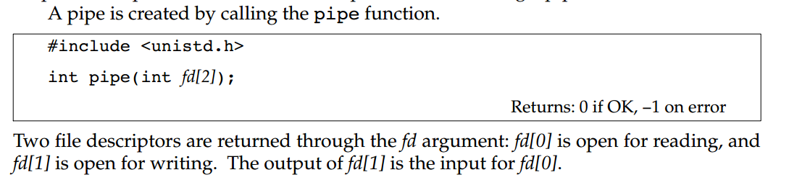
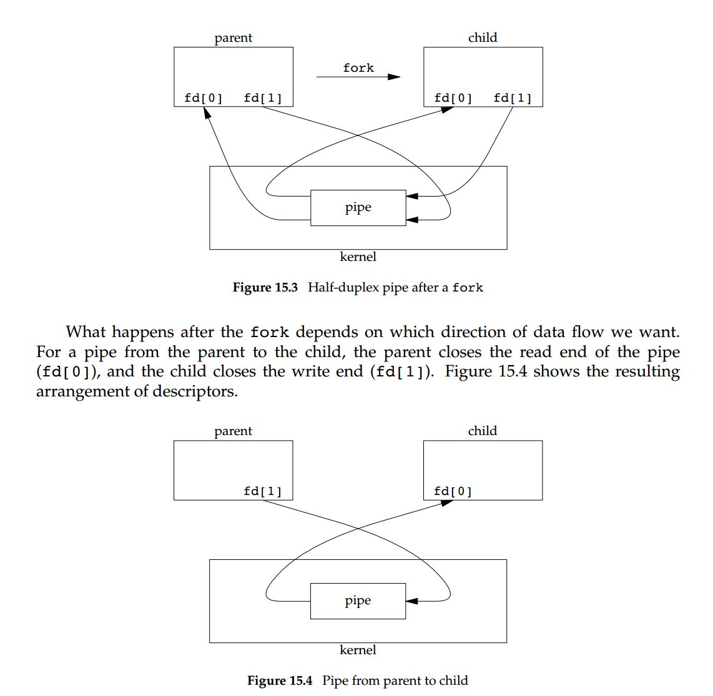
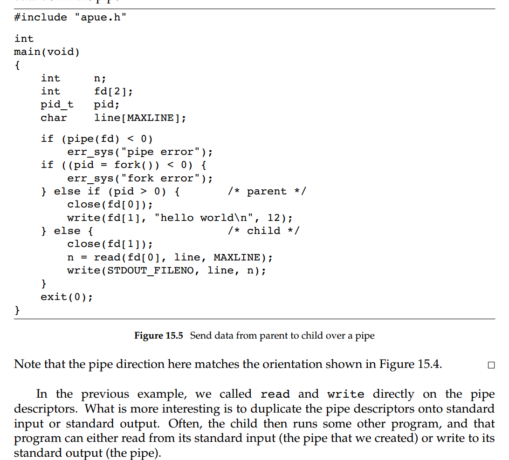

1、swoole read、write  通过管道实现父子进程之间的通信。

2、我们执行一个shell命令时：     

Every time you type a sequence of commands in a pipeline for the shell toexecute, the shell creates a separate process for each command and links the standardoutput of one process to the standard input of the next using a pipe.

3、管道原理




>  A pipe in a single process is next to useless. Normally, the process that calls pipethen calls fork, creating an IPC channel from the parent to the child, or vice versa.




> 疑问： fork之后，内核中的管道是父进程、子进程共享？
>
> （1）关于fork之后，父子进程哪些可以共享、哪些不能共享还需要学习。
>
> （2）用户态、内核的关系。

4、管道的一个经常用法：



> 把管道的fd复制到标准输入、输出，然后在子进程中运行其他程序，这个程序可以从标准输入读取数据，然后往标准输出（管道）写入数据。

5、利用管道实现一个分页程序：调用系统程序/bin/less

```
#include "apue.h"
#include <sys/wait.h>

#define    DEF_PAGER    "/bin/more"        /* default pager program */

int
main(int argc, char *argv[])
{
    int        n;
    int        fd[2];
    pid_t    pid;
    char    *pager, *argv0;
    char    line[MAXLINE];
    FILE    *fp;

    if (argc != 2)
        err_quit("usage: a.out <pathname>");

    if ((fp = fopen(argv[1], "r")) == NULL)
        err_sys("can't open %s", argv[1]);
    if (pipe(fd) < 0)
        err_sys("pipe error");

    if ((pid = fork()) < 0) {
        err_sys("fork error");
    } else if (pid > 0) {                                /* parent */
        close(fd[0]);        /* close read end */

        /* parent copies argv[1] to pipe */
        while (fgets(line, MAXLINE, fp) != NULL) {
            n = strlen(line);
            if (write(fd[1], line, n) != n)
                err_sys("write error to pipe");
        }
        if (ferror(fp))
            err_sys("fgets error");

        close(fd[1]);    /* close write end of pipe for reader */

        if (waitpid(pid, NULL, 0) < 0)
            err_sys("waitpid error");
        exit(0);
    } else {                                        /* child */
        close(fd[1]);    /* close write end */
        if (fd[0] != STDIN_FILENO) {
            if (dup2(fd[0], STDIN_FILENO) != STDIN_FILENO)
                err_sys("dup2 error to stdin");
            close(fd[0]);    /* don't need this after dup2 */
        }

        /* get arguments for execl() */
        if ((pager = getenv("PAGER")) == NULL)
            pager = DEF_PAGER;
        if ((argv0 = strrchr(pager, '/')) != NULL)
            argv0++;        /* step past rightmost slash */
        else
            argv0 = pager;    /* no slash in pager */

        if (execl(pager, argv0, (char *)0) < 0)
            err_sys("execl error for %s,%s", pager,argv0);
    }
    exit(0);
}

```